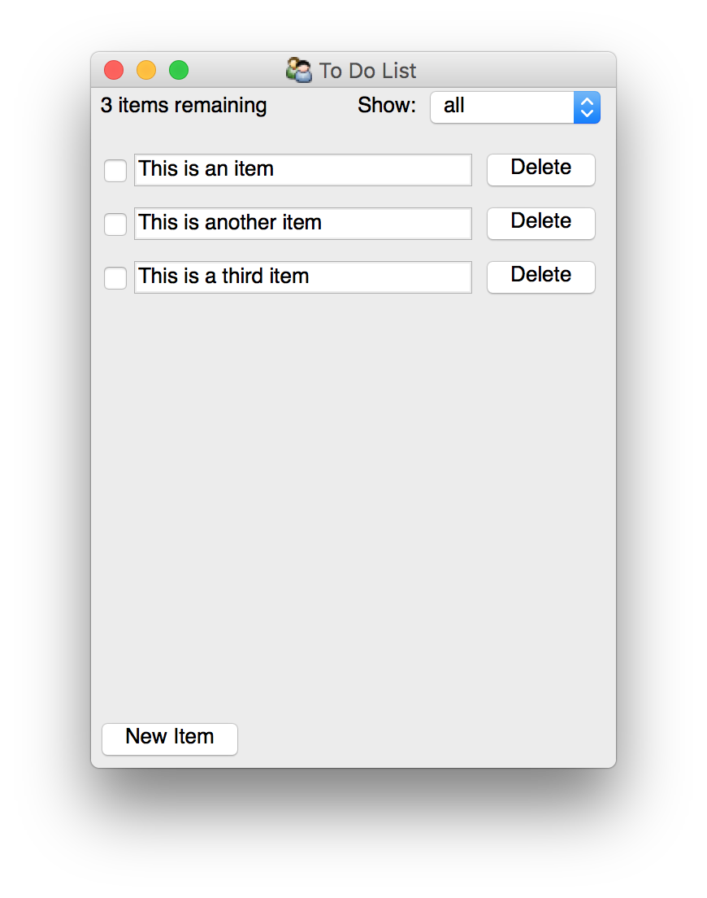

======================
To-do List Application
======================

.. include:: ../../todo-list/README.rst

To-do List Documentation
========================

.. py:module:: todo_list

Module ``todo_list.app``: Application Main
------------------------------------------

.. automodule:: todo_list.app
    :members:

Module ``todo_list.model`` : To-Do List Model Classes
-----------------------------------------------------

.. automodule:: todo_list.model
    :members:

Module ``todo_list.view`` : To-Do List UI Classes
-------------------------------------------------
.. automodule:: todo_list.view
    :members: ToDoItemController, ToDoListModelView,

    .. data:: to_do_item_view
        :annotation: = TraitsUI View instance

    .. data:: todo_list_view
        :annotation: = TraitsUI View instance

Exercises
=========

If you are learning how to work with Traits and TraitsUI, working through these
exercises may be illuminating.

1. Extend the :py:class:`todo_list.model.ToDoItem` class to include an optional
   due date.  The default value of the due date should be a week from the
   current day.

   Hint: The :py:class:`Date` trait is useful here.

2. Extend the :py:class:`todo_list.model.ToDoList` class to additionally
   provide a property containing the list of all overdue items, that is items
   which are not complete and which have a due date before the current due
   date.

3. Extend the user interface to expose the due date and overdue items in a
   user-friendly manner.  You should allow the user to:

   * toggle whether or not any given item has a due date and allow them to set
     it if there is one in the :py:class:`todo_list.view.ToDoItemController`
     class,

   * select whether they want to view all the items, the remaining items, or
     just the overdue items, and whether the items should be sorted by due date
     or not.
